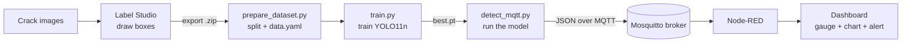

# crack-detection-pipeline

This is my crack detection project. The goal was to build a full computer
vision pipeline using only open source tools, instead of paying for something
like Roboflow. It goes from labelling images all the way to a live dashboard:

**Label Studio (labelling) → YOLO11 (model) → Node-RED (dashboard).**

The detections are sent over MQTT, so the camera script and the dashboard are
separate programs that talk to each other. I based the general idea on the
[IVIS project](https://github.com/msf4-0/Integrated-Vision-Inspection-System-IVIS),
which also uses Label Studio for labelling and MQTT to feed Node-RED.

There is only one class in this project: `crack`. I did not include a dataset,
you have to bring your own images and labels.

---

## How it fits together



---

## What's in here

```
crack-detection-pipeline/
├── scripts/
│   ├── prepare_dataset.py   # take Label Studio export.zip, split into train/val/test, make data.yaml
│   ├── split_colab.py       # same thing but no zip, for running in a Colab cell
│   ├── train.py             # train YOLO11n on the dataset
│   └── detect_mqtt.py       # run the model and send results over MQTT
├── nodered/
│   └── flow.json            # the Node-RED dashboard (import this)
├── models/                  # trained best.pt goes here
├── docs/                    # results.png and val_batch0_pred.jpg go here
├── requirements.txt
├── TESTING.md               # how to demo it without a webcam
└── README.md
```

---

## Setup

**1. Python packages (needs Python 3.10 or newer)**

```bash
python -m venv .venv && source .venv/bin/activate   # Windows: .venv\Scripts\activate
pip install -r requirements.txt
pip install label-studio      # the labelling tool, quite big so a separate venv is fine too
```

**2. MQTT broker (Mosquitto)**

```bash
# Ubuntu
sudo apt install mosquitto mosquitto-clients
# macOS
brew install mosquitto && brew services start mosquitto
# Windows: download the installer from https://mosquitto.org/download/
```

It runs on `localhost:1883`, which is what the scripts and the flow expect.

**3. Node-RED and the dashboard**

```bash
npm install -g --unsafe-perm node-red
node-red   # opens on http://localhost:1880
```

Then install the dashboard nodes: **Menu → Manage palette → Install →
`node-red-dashboard`**.

---

## The full workflow

**1. Label the images in Label Studio**

```bash
label-studio start        # http://localhost:8080
```

Make a project, pick the **Object Detection with Bounding Boxes** template, add
one label called `crack`, and draw boxes on your images. When you are done, go
to **Export → "YOLO with images"** and download the zip.

**2. Prepare the dataset**

```bash
cd scripts
python prepare_dataset.py path/to/export.zip --out ../dataset --seed 42
```

This unzips the export, splits it 70/20/10 into train/val/test, and writes
`data.yaml`. The seed keeps the split the same every time you run it, and it
prints a small table of how many images ended up in each split.

**3. Train the model**

```bash
python train.py --data ../dataset/data.yaml --epochs 50 --imgsz 640
```

This downloads `yolo11n.pt` the first time, trains, and copies the best weights
to `../models/best.pt`. It also prints the augmentations that YOLO does during
training. I added that print because Label Studio does not do any augmentation
itself, so it is worth seeing where the augmentation actually happens.

**4. Run detection and send results over MQTT**

```bash
python detect_mqtt.py --weights ../models/best.pt --broker localhost
# or point it at a video or a folder of images instead of the webcam:
python detect_mqtt.py --weights ../models/best.pt --source ../clips/wall.mp4
```

This opens a preview window with boxes drawn on it, sends the results as JSON to
`ivis/crack/detections` about twice a second, and sends an online/offline status
on `ivis/crack/status`.

**5. See it on the dashboard in Node-RED**

Import `nodered/flow.json` (**Menu → Import**), click **Deploy**, then open
`http://localhost:1880/ui`. You get a crack count gauge, a chart of the
confidence over time, and a text box that goes red when there is a crack. If you
don't have a camera, click the **"test: 2 cracks"** inject node to push a fake
message through and check the dashboard works.

The JSON that gets sent on `ivis/crack/detections` looks like this:

```json
{
  "timestamp": 1700000000.0,
  "count": 2,
  "detections": [
    { "class": "crack", "confidence": 0.91, "bbox": [10, 20, 120, 140] },
    { "class": "crack", "confidence": 0.77, "bbox": [200, 60, 300, 180] }
  ]
}
```

---

## Results

I trained YOLO11n on 150 crack images that I labelled in Label Studio, split
70/20/10, for 50 epochs at image size 640. I ran the training on Google Colab
with a free T4 GPU.

| Metric          | Value      |
| --------------- | ---------- |
| mAP@50          | 0.984      |
| mAP@50-95       | 0.722      |
| Precision       | 0.899      |
| Recall          | 1.000      |
| Inference speed | 3.2 ms/img |


**A note on these numbers.** The dataset is small (150 images, only about 30 in
the validation set) and every single image has a crack in it. There are no
"clean" images with no cracks. Because of that, the model has never had to say
"no crack here", so the recall of 1.0 and the high mAP@50 look better than they
really are. I would treat these as a sign that the pipeline works, not as proper
benchmark numbers. To make it more realistic I would need to add background
images with no cracks and use a bigger validation set.

### How I trained it on Colab

These are the actual steps I ran in Colab, after uploading the Label Studio
`export.zip`:

```bash
# 1. install ultralytics
!pip install -q ultralytics

# 2. unzip the Label Studio export
!unzip -q export.zip -d export

# 3. split it 70/20/10 and make data.yaml (the no-zip version of the script)
!python scripts/split_colab.py export --out ds --seed 42

# 4. train YOLO11n
!yolo detect train model=yolo11n.pt data=ds/data.yaml epochs=50 imgsz=640

# 5. download these files afterwards:
#    runs/detect/train/weights/best.pt        -> models/best.pt
#    runs/detect/train/results.png            -> docs/results.png
#    runs/detect/train/val_batch0_pred.jpg    -> docs/val_batch0_pred.jpg
```

`split_colab.py` does the same job as `prepare_dataset.py` but works on an
already-unzipped folder, which was easier to use inside a Colab cell.

---

## Why Label Studio and not Roboflow

Roboflow is nice because it does a lot of things in one place, but it is a paid
hosted service and you are tied to it. I wanted everything open source and
running on my own machine, so I used Label Studio for the labelling and let
Ultralytics and my own script handle the parts Label Studio doesn't do.

| Thing              | Label Studio (what I used)              | Roboflow                        |
| ------------------ | --------------------------------------- | ------------------------------- |
| Labelling          | Yes                                     | Yes                             |
| Augmentation       | No, YOLO does it during training        | Yes, built in                   |
| Train/val/test split | No, my `prepare_dataset.py` does it   | Yes, one click                  |
| Dataset versioning | Basic, mostly manual                    | Yes, proper versioning          |
| Training           | No, done separately with YOLO11         | Yes, hosted training            |
| Hosting            | You host it yourself                     | Hosted for you                  |
| Export formats     | YOLO, COCO, VOC, etc.                    | Lots of formats                 |
| Cost               | Free and open source                     | Free tier then paid             |
| Data privacy       | Stays on your own machine                | In the cloud by default         |

So the trade-off is that Roboflow saves you effort but costs money, and this
setup takes a bit more work but is free and stays on your own hardware.

---

## Notes

- Every script uses argparse, so you can run any of them with `-h` to see the
  options.
- `detect_mqtt.py` uses the paho-mqtt v2 API. It also sends a "last will"
  message so Node-RED knows if the camera script crashes or stops.
- The broker and topics (`localhost:1883`, `ivis/crack/detections`) are the same
  in the script and in the Node-RED flow, so they connect without any changes.
```
